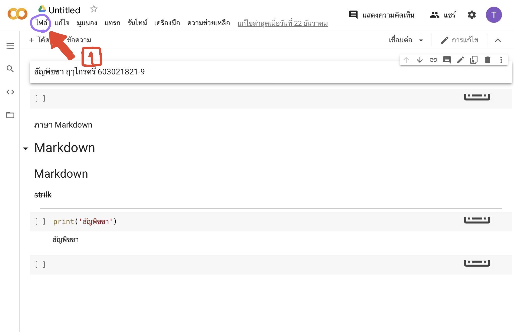
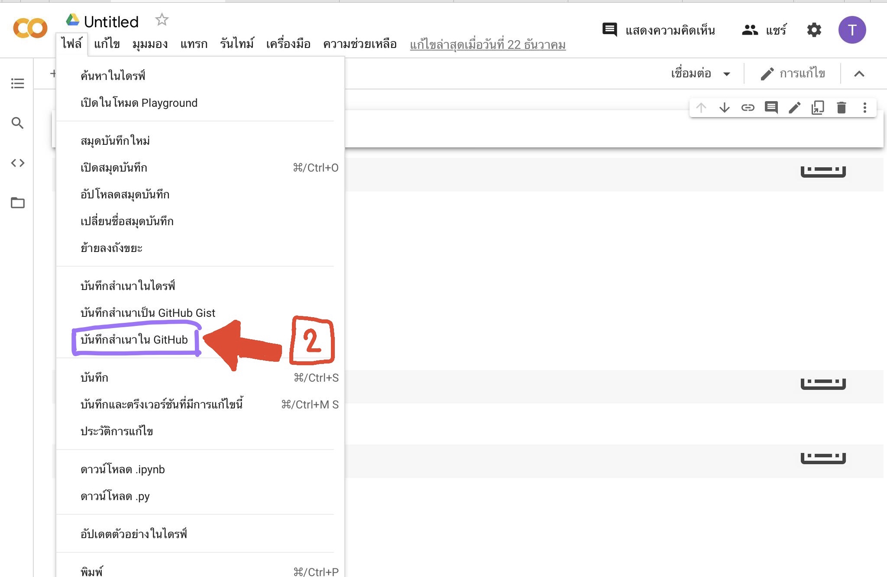
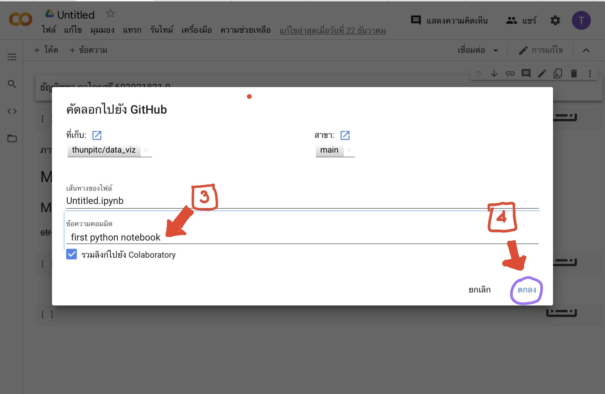

# data_viz

ธัญพิชชา ฤาไกรศรี 603021921-9

ตัวอย่างการเพิ่มรูป

# การบ้านครั้งที่1

ขั้นตอนการบันทึกไฟล์จาก google colab in github

# ขั้นที่ 1 ไปยังเมนู ไฟล์

# ขั้นที่ 2 คลิกที่ บันทึกสำเนาใน GitHub

# ขั้นที่ 3 พิมพ์ข้อความคอมมิต และขั้นตอนที่ 4 คลิก ตกลง

